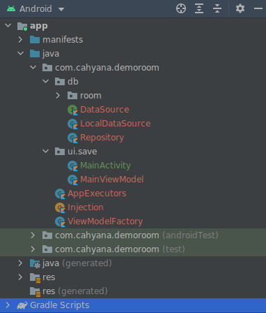

## Projek Dasar | LiveData
* Struktur Projek


* Entity
```kotlin
@Entity(tableName = "books")
data class Book(
    @PrimaryKey(autoGenerate = true)
    val id: Int,
    val title: String,
    val author: String
)
```

* Dao
```kotlin
@Dao
interface BookDao {

    @Query("SELECT * FROM books")
    fun getAll(): LiveData<List<Book>>
    
    //..
}
```

* Database
```kotlin
@Database(entities = [Book::class], version = 1)
abstract class BookDatabase : RoomDatabase() {

    abstract fun bookDao(): BookDao

    companion object {
        private var instance: BookDatabase? = null

        fun getInstance(context: Context): BookDatabase {
            if (instance == null) {
                synchronized(this) {
                    if (instance == null) {
                        Room.databaseBuilder(context.applicationContext,
                            BookDatabase::class.java,
                            DATABASE_NAME
                        )
                            .build().apply { instance = this }
                    }
                }
            }
            return instance as BookDatabase
        }
    }
}
```

* LocalDataSource
```kotlin
class LocalDataSource(private val bookDao: BookDao, 
                      private val appExecutors: AppExecutors) : DataSource {

    override fun save(books: List<Book>) {
        appExecutors.diskIO().execute {
            bookDao.save(books)
        }
    }
    
    override fun find(title: String) = bookDao.find(title)
    
    //...
}
```

* Repository
```kotlin
class Repository(private val localDataSource: LocalDataSource) {

    fun save(books: List<Book>) {
        localDataSource.save(books)
    }
    
    fun find(title: String): LiveData<List<Book>> =
        localDataSource.find(title)
    //...
}
```

* ViewModel
```kotlin
class MainViewModel(private val repository: Repository): ViewModel() {

    fun getBook() = repository.getAll()

    fun updateBook(book: Book) {
        repository.update(book)
    }
}
```

* ViewModel Factory
```kotlin
class ViewModelFactory(private val repository: Repository) : ViewModelProvider.Factory {

    override fun <T : ViewModel?> create(modelClass: Class<T>): T {
        if (modelClass.isAssignableFrom(MainViewModel::class.java)) {
            return MainViewModel(repository) as T
        } else {
            throw IllegalArgumentException("Unknow ViewModel class")
        }
    }
}
```

* AppExecutor
```kotlin
class AppExecutors @JvmOverloads constructor(
    private val diskIO: Executor = Executors.newSingleThreadExecutor(),
    private val networkIO: Executor = Executors.newFixedThreadPool(3),
    private val mainThread: Executor =
        MainThreadExecutor()
) {
    fun diskIO(): Executor = diskIO

    fun networkIO(): Executor = networkIO

    fun mainThread(): Executor = mainThread

    private class MainThreadExecutor : Executor {
        private val mainThreadHandler =
            Handler(Looper.getMainLooper())

        override fun execute(command: Runnable) {
            mainThreadHandler.post(command)
        }
    }
}
```

* Injection
```kotlin
object Injection {

    private fun getDataSource(context: Context): LocalDataSource {
        val db = BookDatabase.getInstance(context)
        return LocalDataSource(db.bookDao(), AppExecutors())
    }

    fun provideRepository(context: Context): Repository {
        return Repository(getDataSource(context))
    }

    fun provideViewModelFactory(repository: Repository): ViewModelFactory {
        return ViewModelFactory(repository)
    }
}
```